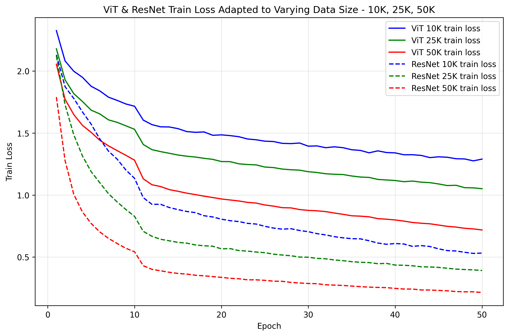
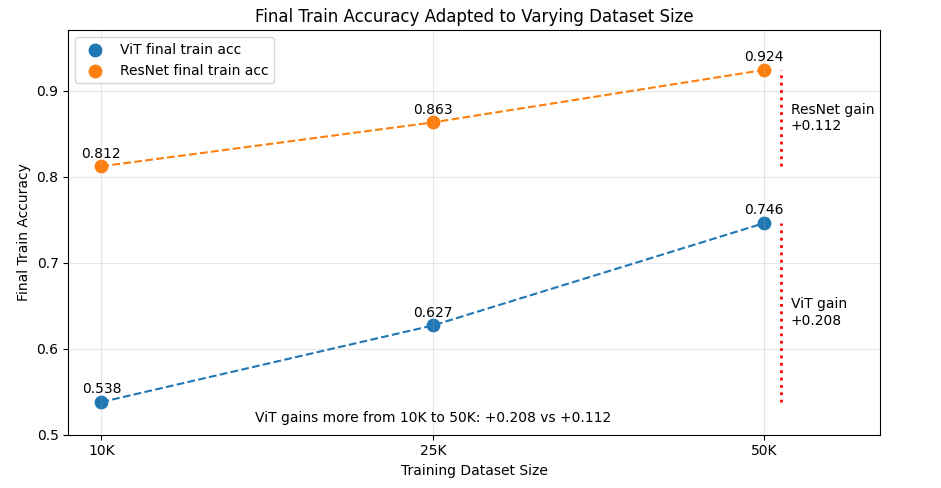

# Experimental Results

This document summarizes the main experimental results and my observations.

Training conditions of experiments are indicated below

---

## 1. Adaption to Varying Data Size

| Train Accuracy | Train Loss |
| :---: | :---: |
|  |  |

| Increased Accuracy Gap| 
| :---: |
|  |

### Observation

- ResNet44 and PlainNet44 have almost similar parameter counts.
- ResNet44 has 0.661M trainable parameters
- PlainNet44 has 0.658M trainable parameters

### Interpretation

- ResNet44 requires marginally more parameters due to shortcut operations(Option B according to this paper), but the difference is negligible.

---

## 2. Knowledge Distillation

### Observation

- ResNet44 gains higher accuracy(by 9.0%) than PlainNet44
- ResNet44 starts convergence earlier than PlainNet44

### Interpretation

- Deep neural network with residual architecture is easier to optimize
- Skip connections used in every residual blocks, which represented as identity mapping, helps responses flow easier.  

---

## 3. Degradation Problem: 20-layer vs 56-layer Networks

### Observation

- Plain network gains seriously lower accuracy when layer gets deeper(20 -> 56 depth).
- Residual network even gains slightly more accuracy when layer gets deeper(20 -> 56 depth).
- Considering shallower depth(20-depth), ResNet20 converges faster than PlainNet20 and gains more accuracy(by 2.0%).
- Considering deeper depth(56-depth), ResNet56 converges much faster than PlainNet56 and gains a far more accuracy(by 16.0%).  

### Interpretation

- Plain network suffers from *the degradation problem*(accuracy satured at some specific depth and decrease seriously), this phenomena occurs due to neither overfitting(no train/test accuracy gap) nor vanishing gradients(addressed by BN)
- Residual network addresses *the degradation problem* and make optimization easier.

---

**Training conditions**

| Conditions | Experiment 1 | Experiment 2 |
|---|---|---|
| Dataset | CIFAR-10 (10K, 25K, 50K) | CIFAR-10 (50K) |
| Optimizer | Adam | AdamW |
| Learning rate scheduler | Constant + Drop | Linear warmup + Cosine annealing |
| Learning rate | 0.001(1-10 epoch) + 0.0001(11-50 epoch) | 0.0005 to 0.00001(6-40 epoch) |
| Batch size | 128 | 128 |
| Epochs | 50 | 40 |
| Data augmentation | Random crop, Horizontal flip, Color jitter, Gray scale, Normalize | Random crop, Horizontal flip, Color jitter, Gray scale, Normalize |
| Weight decay | 0 | 0.001 |
| Device | cuda | cuda |
